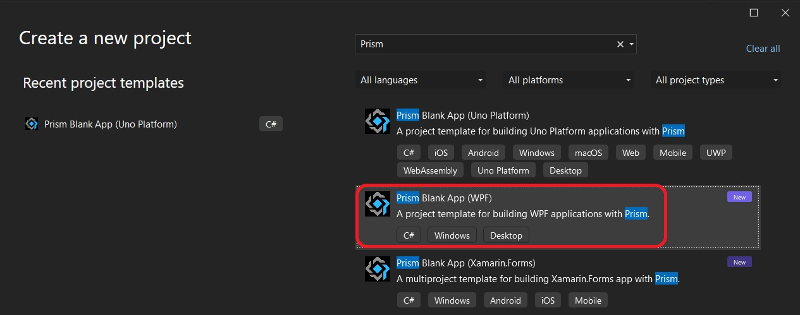
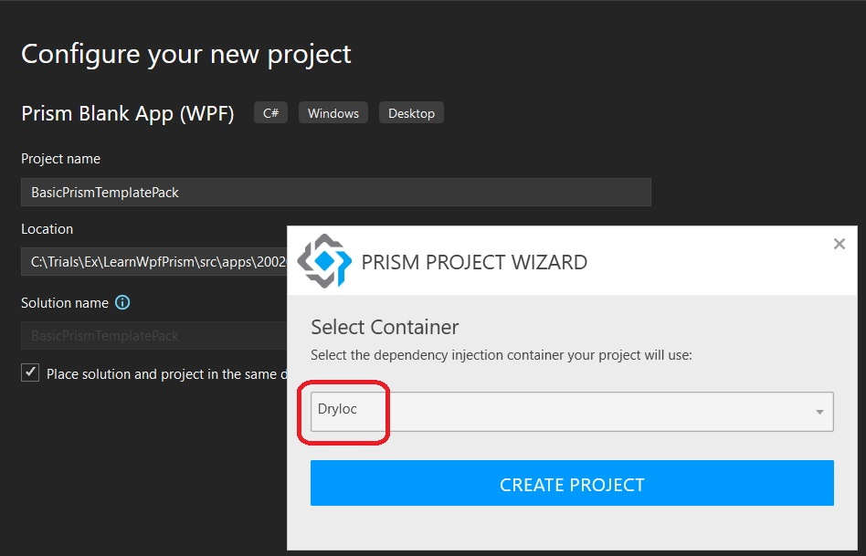

# Basic Prism App
- Creates a basic Wpf app and then adds Prism to it.

- Create a Prism wpf app using [Visual Studio Template Pack Extension](https://marketplace.visualstudio.com/items?itemName=BrianLagunas.PrismTemplatePack).

## Pre Reqs
- Visual STudio 2022, V17.4.0 or above. This update is necessary because this installs .net 7. And the examples here are with .net 7 and not .net 6.
- [Prism Template Pack extension](https://marketplace.visualstudio.com/items?itemName=BrianLagunas.PrismTemplatePack).
- Choose a correct template as follows.



- Configure it.



- Finally change the target platform to net7.0, by default, its net6.0 when created.
```xml
<TargetFramework>net7.0-windows</TargetFramework>
```
- 