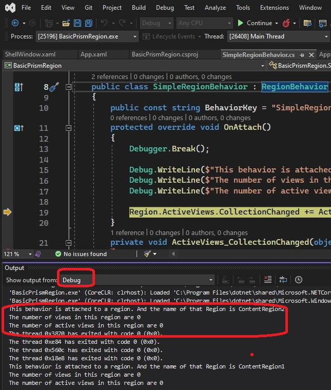

# Basic Prism App
- Introduces Region Behaviors in Prism App

- Add a class **SimpleRegionBehavior**. Derive it from RegionBehavior
- Then register this behavior with the prism in App.xaml.cs class as follows.
- The following code creates a region in the shell.
```cs
protected override void ConfigureDefaultRegionBehaviors(IRegionBehaviorFactory regionBehaviors)
{
    base.ConfigureDefaultRegionBehaviors(regionBehaviors);
    regionBehaviors.AddIfMissing(SimpleRegionBehavior.BehaviorKey, typeof(SimpleRegionBehavior));
}
```

- Run the app in visual Studio. Debugger.Break(), will break the app inside of the Attach method. Then it will output some info for you.
- In Visual Studio 2022, open the output window, View -> Output(Ctrl + Alt + O). Choose Debug, in the drop down, see the image.

- A Behaviour has got a Region Property, and a Region has got Behaviors(plural) property. So one region can have multiple behaviors attached to it. And a behavior has a region. Its a two way relation ship.