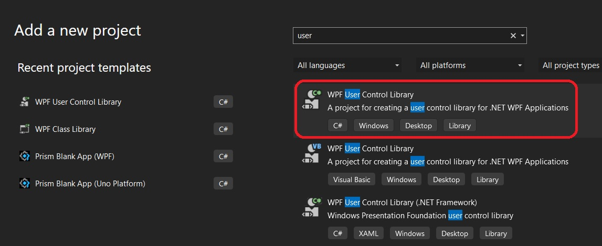

# Basic Prism App with Modules

- Introduces Prism Modules

- This builds from Basic Prism example, 200200-BasicPrism example. The project name has been changed.

- Then add a Wpf User control library. 
- The module registration is in the code. Other ways, in the subsequent examples.



- Remove AssemblyInfo file and UserControl1 as well. They are not needed.
- Add two folders Views and ViewModels
- Add a nuget Prism.Wpf package to this module project
- Create the actual module class, that is a class implimenting IModule.
- 

```cs
public class ModuleAModule : IModule
{
    public void OnInitialized(IContainerProvider containerProvider)
    {
        // throw new NotImplementedException();
        Debugger.Break();
    }
    public void RegisterTypes(IContainerRegistry containerRegistry)
    {
        Debugger.Break();
        // throw new NotImplementedException();
    }
}
```

- Now add reference to the module class library. 
- The module is registered as follows.
```cs
protected override void ConfigureModuleCatalog(IModuleCatalog moduleCatalog)
{
    Debugger.Break();
    moduleCatalog.AddModule<ModuleAModule>();
    Debugger.Break();
}
```
- Now run the app. Notive that the break points in the module shon above were hit.
