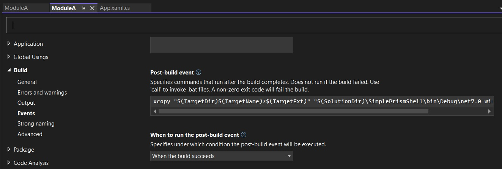

# Basic Prism App with Modules

- Introduces Prism Modules

- This builds from Previouis example.
- In this example, the module registration happens by DirectoryModuleCatalog in App.xaml.cs
- 


```cs
protected override IModuleCatalog CreateModuleCatalog()
{
    return new DirectoryModuleCatalog() { ModulePath = @".\Modules" };
}
```

Now add the following code to the ModuleA.csproj file, to copy the moduleA.dll 


```xml
<Target Name="PostBuild" AfterTargets="PostBuildEvent">
  <Exec Command="xcopy &quot;$(TargetDir)$(TargetName)*$(TargetExt)&quot; &quot;$(SolutionDir)\SimplePrismShell\bin\Debug\net7.0-windows\Modules\&quot; /Y /S" />
</Target>
```



- Now run the app. Notive that the break points in the module shon above were hit.
